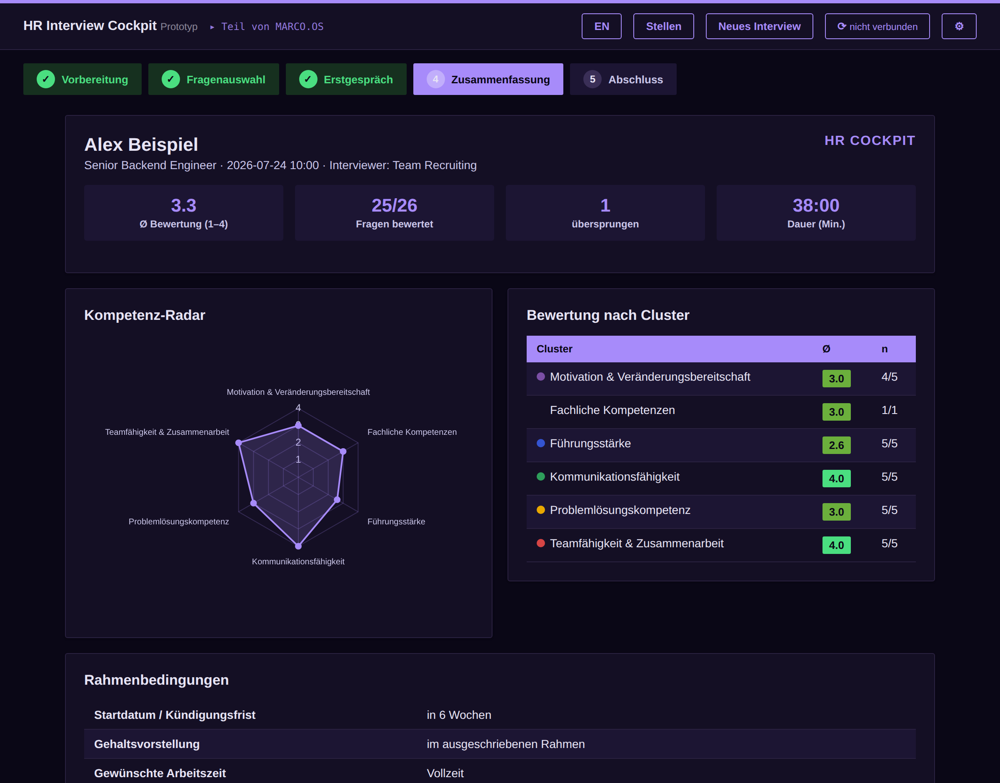
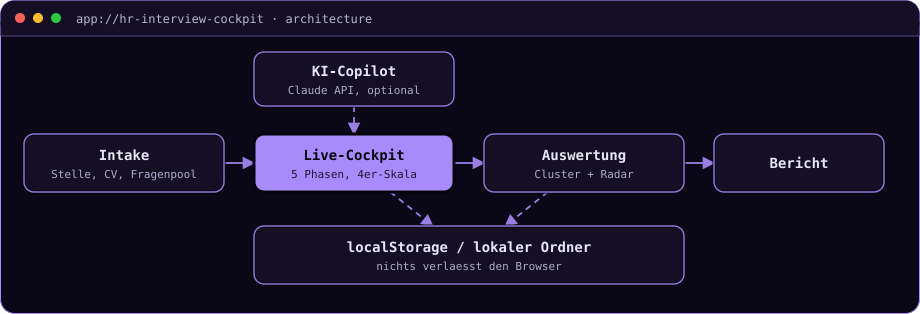

# HR Interview Cockpit

**Führt strukturierte Einstellungsinterviews von der Stellenanzeige bis zum Bericht: ein
einziges HTML-File ohne Backend und ohne Build-Step, damit Kandidatendaten den Rechner nie
verlassen.**


[](https://maggostang-droid.github.io/interview-cockpit/)

> **▶ [Demo ausprobieren](https://maggostang-droid.github.io/interview-cockpit/)**
> Klick auf dem Startbildschirm „Beispiel-Auswertung ansehen": Das lädt ein komplett
> ausgefülltes Interview mit fiktiver Stelle, fiktivem Kandidaten, Kompetenz-Radar und
> Bericht.
> *Statische Seite auf GitHub Pages, kein Cold-Start.*



<details>
<summary><b>🇬🇧 English summary</b></summary>

A single-file, client-side tool for running structured hiring interviews: job and CV
intake (PDF text extraction in the browser), an importable question pool (xlsx), a live
cockpit with timer, five interview phases and 4-point behavioural-anchor ratings, plus a
competency radar and an exportable report. No backend and no build step, so candidate data
never leaves the machine. Sanitised portfolio version with synthetic content only. Full
write-up in German below.
</details>

---

## In 30 Sekunden

Ein kompletter Interview-Workflow in einer Datei. Stelle und Lebenslauf werden erfasst, der
CV wird als PDF importiert und direkt im Browser in Text umgewandelt. Ein eigener
Fragenpool lässt sich als xlsx laden. Im Live-Cockpit führt das Tool durch fünf Phasen
(Begrüßung, Vorstellung des Ablaufs, Fachfragen, Verhaltensfragen mit CV-Bezug, Abschluss),
mit Timer und Bewertung jeder Frage auf einer 4er-Skala mit Verhaltensankern. Am Ende
stehen Auswertung nach Kompetenz-Clustern, ein Kompetenz-Radar und ein exportierbarer
Bericht. Die Oberfläche ist deutsch und englisch.

## Die zentrale Entscheidung: es gibt keinen Server, an den Daten gehen könnten

Interviewdaten gehören zum Sensibelsten, was ein HR-Prozess erzeugt: Lebensläufe,
Bewertungen, Einstellungsempfehlungen. Statt das über Zugriffsrechte auf einem Server zu
lösen, ist hier die Architektur selbst die Antwort. Alle Daten liegen im `localStorage` des
Browsers oder, über die File System Access API, in einem lokalen Ordner, den der Nutzer
selbst wählt. Es existiert kein Backend, das sie speichern könnte.

Die einzige Ausnahme ist der optionale KI-Copilot für Fragenvorschläge. Er ruft
`api.anthropic.com` direkt aus dem Browser auf, mit einem API-Key, den der Nutzer selbst
einfügt und der nur in seinem Browser liegt. Kein Proxy-Server sieht Key oder Daten. Diese
Konstruktion braucht den Header `anthropic-dangerous-direct-browser-access`, und der Name
ist Programm: Sie ist für ein lokales Einzelnutzer-Tool vertretbar und für eine öffentliche
Mehrbenutzer-App nicht.

<details>
<summary><b>▸ Deep Dive: Herkunft und Datenschutz-Abgrenzung</b></summary>

Ursprünglich als privates Tool während eines realen Bewerbungsprozesses bei Festo gebaut,
ohne Anstellungsverhältnis. Dies ist eine bereinigte, umbenannte Fassung mit ausschließlich
synthetischen Inhalten: fiktive Stellenanzeige, fiktiver Beispiel-Kandidat, selbst
geschriebene generische Fragensammlung. Keine echten Kandidatendaten, keine echten
Stellenausschreibungen, keine Kompetenzmodelle Dritter.

Drei Bibliotheken werden per CDN geladen: SheetJS für den xlsx-Import, Chart.js für das
Kompetenz-Radar und pdf.js für die CV-Textextraktion.
</details>

## Architektur



Der gestrichelte Pfad zum Speicher ist der entscheidende: Er endet im Browser, nicht in
einer Cloud. Und der KI-Copilot ist optional, ohne ihn funktioniert der gesamte Workflow.

## Was es kann, und was nicht

Ehrliche Einordnung statt Feature-Marketing: Das ist ein kompaktes Werkzeug, kein Produkt.

| Größe | Wert |
|---|---|
| Umfang | eine HTML-Datei, rund 2.000 Zeilen, etwa 140 KB |
| Abhängigkeiten | 3 Bibliotheken per CDN, kein Framework, kein Build |
| Interview-Phasen | 5, mit Timer und Phasen-Tracking |
| Bewertung | 4er-Skala mit Verhaltensankern, Auswertung pro Cluster |
| Automatisierte Tests | **keine** |

**Was dieses Projekt nicht ist:** Die fehlenden Tests sind bei rund 2.000 Zeilen in einer
Datei die größte technische Schuld des Projekts, verifizierbar ist es derzeit nur über die
Beispiel-Auswertung in der Demo. Es ist außerdem ein Einzelnutzer-Tool und gerätegebunden:
kein Account, kein Sync, keine gemeinsame Bewertung durch mehrere Interviewer. Der
`localStorage` hat Größenlimits und verschwindet mit den Browserdaten, weshalb der Export
in einen lokalen Ordner der stabilere Weg ist. Und es gibt keine ATS-Schnittstelle.

## Selbst ausprobieren

Es gibt nichts zu installieren. Entweder die Demo oben öffnen oder:

```bash
git clone https://github.com/maggostang-droid/interview-cockpit.git
# danach index.html im Browser öffnen
```

---

```console
marco@portfolio:~$ open marco-os --project hr-interview-cockpit
```

**[▸ Dieses Projekt in MARCO.OS öffnen](https://maggostang-droid.github.io/marco-os/#hr-interview-cockpit)**,
dem interaktiven Portfolio von Marco Stang.

**Schwesterprojekte:**
[SQL Copilot](https://github.com/maggostang-droid/sql-copilot) (LangGraph-Agent mit Guardrails) ·
[Review Risk Predictor](https://github.com/maggostang-droid/review-risk-predictor) (erklärbares ML, React/FastAPI) ·
[Ask-Marco Assistant](https://github.com/maggostang-droid/ask-marco-assistant) (Chat über alle Projekte)

<sub>Marco Stang · Dr.-Ing. · [LinkedIn](https://www.linkedin.com/in/marco-stang) · stang.marco@t-online.de · MIT-Lizenz</sub>
