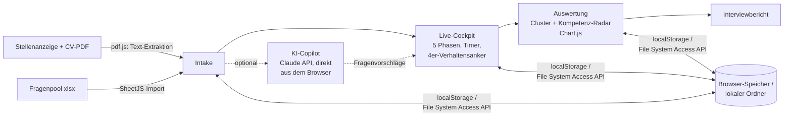

# HR Interview Cockpit

Ein Single-File-Tool für strukturierte Einstellungsinterviews — von der
Stellenanzeige über den Fragenpool bis zum Live-Cockpit mit Timer,
Phasen-Tracking, 4er-Verhaltensanker-Bewertung und Kompetenz-Radar.
Komplett client-seitig: kein Backend, kein Build-Step, keine Installation.

Portfolio-Projekt von Marco Stang für Bewerbungen auf AI/KI-Rollen.

<!-- TODO(Marco): Screenshot der Demo hier einfügen:
      -->

## Live-Demo

👉 **[maggostang-droid.github.io/interview-cockpit](https://maggostang-droid.github.io/interview-cockpit/)**

Läuft als statische Seite auf GitHub Pages — kein Cold-Start, sofort da.
Der schnellste Einstieg: auf dem Startbildschirm **"Beispiel-Auswertung
ansehen"** klicken, das lädt ein komplett ausgefülltes Beispiel-Interview
(fiktive Stelle, fiktiver Kandidat) inklusive Radar-Chart und Bericht.

## Was das Tool macht

Ein kompletter Interview-Workflow in einer Datei:

1. **Vorbereiten.** Stellen-Übersicht und Kandidatendaten anlegen; der
   Lebenslauf wird als PDF importiert und der Text direkt im Browser
   extrahiert (pdf.js). Ein eigener Fragenpool lässt sich als
   xlsx-Datei importieren (SheetJS).
2. **Planen.** Termin im eingebauten Kalender wählen.
3. **Interviewen.** Das Live-Cockpit führt durch fünf Phasen (Begrüßung &
   Smalltalk → Vorstellung der Interviewer & des Ablaufs → Fachfragen →
   Verhaltensfragen mit CV-Bezug → Abschluss & Ausblick) — mit Timer,
   Phasen-Tracking und Bewertung jeder Frage auf einer 4er-Skala mit
   Verhaltensankern.
4. **Entscheiden.** Auswertung nach Kompetenz-Clustern, Kompetenz-Radar
   (Chart.js), Gesamteindruck & Empfehlung, exportierbarer
   Interviewbericht. Ein optionaler **KI-Copilot** schlägt auf Basis von
   Stellenanzeige + CV zusätzliche Fragen vor.

Die Oberfläche ist zweisprachig (Deutsch/Englisch).

## Die Architektur-Entscheidung: alles bleibt im Browser

Interviewdaten sind so ziemlich das Sensibelste, was ein HR-Prozess
erzeugt — Lebensläufe, Bewertungen, Einstellungsempfehlungen. Die
zentrale Designentscheidung dieses Projekts ist deshalb radikal:
**es gibt keinen Server, an den diese Daten überhaupt geschickt werden
könnten.**

- Alle Daten (Fragenpool, Kandidaten, gespeicherte Interviews) liegen im
  `localStorage` des Browsers oder — per File System Access API
  (`showDirectoryPicker`) — in einem lokalen Ordner, den man selbst wählt.
- Die einzige Ausnahme ist der optionale KI-Copilot: er ruft
  `api.anthropic.com` **direkt aus dem Browser** auf (mit dem
  `anthropic-dangerous-direct-browser-access`-Header), mit einem API-Key,
  den man selbst einfügt und der nur im eigenen Browser gespeichert wird.
  Kein Proxy-Server, der den Key oder die Daten sehen könnte — der
  Trade-off: diese Konstruktion ist nur für ein lokales
  Einzelnutzer-Tool vertretbar, nie für eine öffentliche Mehrbenutzer-App
  (siehe Limitierungen).



## Zahlen & Umfang

Ehrliche Einordnung statt Feature-Marketing: das ist ein kompaktes
Werkzeug, kein Produkt.

- **Eine einzige HTML-Datei**: ~2.000 Zeilen / ~140 KB, Vanilla
  JS/HTML/CSS ohne Framework.
- **3 Bibliotheken** via CDN: SheetJS (xlsx-Import), Chart.js
  (Kompetenz-Radar), pdf.js (CV-Text-Extraktion).
- **5 Interview-Phasen**, Bewertung auf 4er-Skala mit Verhaltensankern,
  Auswertung pro Kompetenz-Cluster.
- Keine automatisierten Tests, keine Nutzungs-Metriken — verifizierbar
  ist das Tool über die Beispiel-Auswertung in der Live-Demo.

## Quickstart

```bash
# nichts zu installieren — entweder die Live-Demo öffnen oder:
git clone https://github.com/maggostang-droid/interview-cockpit.git
# und index.html im Browser öffnen
```

## Herkunft & Datenherkunft

Ursprünglich als privates Tool während eines realen Bewerbungsprozesses
bei Festo gebaut (kein Anstellungsverhältnis). Dies ist eine bereinigte,
umbenannte Fassung mit ausschließlich synthetischen Inhalten: fiktive
Stellenanzeige, fiktiver Beispiel-Kandidat, selbst geschriebene generische
Fragensammlung. Keine echten Kandidatendaten, Stellenausschreibungen oder
Kompetenzmodelle Dritter.

## Limitierungen

- **Einzelnutzer-Tool, gerätegebunden**: Daten liegen im Browser-Speicher
  des einen Rechners — kein Account, kein Sync, keine Zusammenarbeit
  mehrerer Interviewer an derselben Bewertung.
- **Der Browser-Direktaufruf der Claude-API** ist eine bewusste
  Einzelnutzer-Abkürzung: für jede Mehrbenutzer- oder gehostete Variante
  müsste ein Backend-Proxy den API-Key kapseln.
- **Keine automatisierten Tests** — bei ~2.000 Zeilen in einer Datei die
  größte technische Schuld des Projekts.
- `localStorage` hat Größen-Limits und wird beim Löschen der Browserdaten
  mit entfernt — der lokale Ordner-Export ist dafür der stabilere Weg.
- Kein ATS-Import/-Export (kein Schnittstellen-Anspruch).

## Portfolio-Kontext

Dieses Projekt ist Teil von **[MARCO.OS](https://maggostang-droid.github.io/marco-os/)**,
dem interaktiven Portfolio von Marco Stang — dort lässt sich diese Demo
direkt im Projektfenster ausprobieren. Schwesterprojekte:

- [SQL Copilot](https://github.com/maggostang-droid/sql-copilot) — LangGraph-Agent für Text-to-SQL mit Guardrails und Selbstkorrektur
- [Review Risk Predictor](https://github.com/maggostang-droid/review-risk-predictor) — erklärbare ML-Risikovorhersage (React/FastAPI)
- [Ask-Marco Assistant](https://github.com/maggostang-droid/ask-marco-assistant) — Chat, der alle Portfolio-Projekte kennt (Context-Stuffing + MCP-Server)
